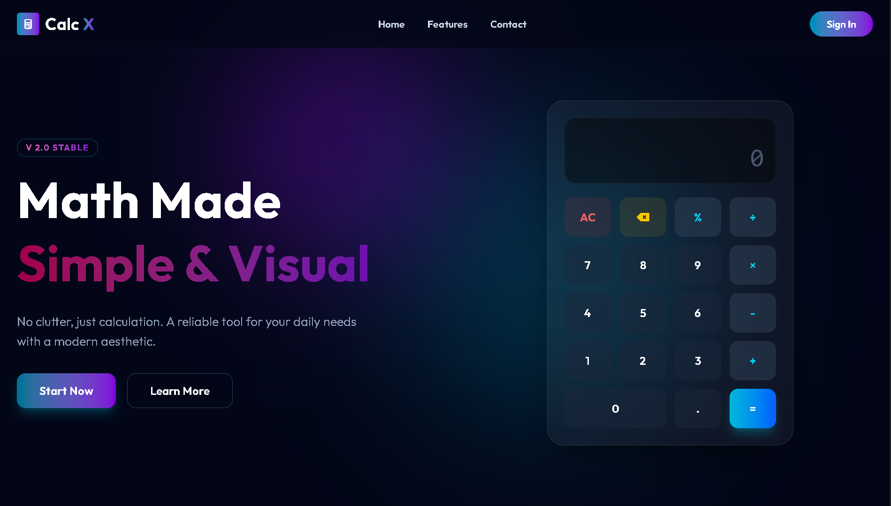
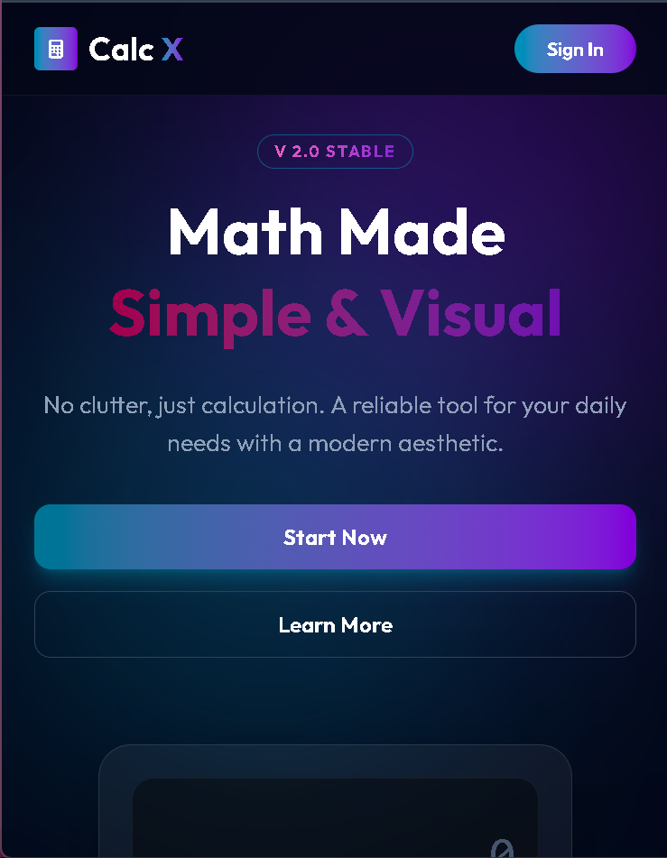

<div align="center">

  

  <a href="https://git.io/typing-svg">
    
  </a>

</div>

<br/>
<div align="center">
# 🧮 CalcX

**A stunning, responsive calculator web app featuring Glassmorphism UI and smooth GSAP animations.**

[](https://vercel.com/new/clone?repository-url=YOUR_GITHUB_REPO_URL)
<br/>


</div>

---

## ⚡ Introduction

**CalcX** is a modern calculator project built with precision and aesthetics in mind. It moves beyond boring, traditional calculators by incorporating a premium **Glassmorphism (Frosted Glass)** design, complemented by smooth entrance and interaction animations powered by **GSAP**. It's fully responsive and works flawlessly on all devices.

---

## ✨ Key Features

- 🎨 **Premium Glassmorphism UI:** Modern frosted glass effect design.
- 🚀 **Smooth GSAP Animations:** Smooth transitions during page loads and button clicks.
- 📱 **Fully Responsive:** Mobile, tablet, and desktop—perfect view on all devices.
- ⌨️ **Smart Input Handling:** Multiple operator or incorrect input prevention.
- 🌙 **Dark Aesthetic:** Dark mode theme that is comfortable for the eyes.
- ⚡ **Instant Results:** Fast math solutions without any reloads.

---

## 🛠️ Tech Stack

- **Frontend Structure:** HTML5 Semantic Tags
- **Styling & Layout:** Tailwind CSS (Utility-first framework)
- **Logic & Functionality:** Vanilla JavaScript (ES6+)
- **Animations:** GSAP (GreenSock Animation Platform)
- **Icons:** FontAwesome 6

## 📸 Screenshots

| Desktop Glass View | Mobile Responsive View |
|:---:|:---:|
|  |  |

---

## 🚀 Getting Started

Since this is a static project, you can run it easily without any backend setup.

1. **Clone the repository:**
   ```bash
   git clone https://github.com/atul-dev-ai/CalcX.git

2. Navigate to the project directory:
   ```Bash
   cd calcx-calculator
   
3. Open the Project:
   Simply open the `index.html` file in your browser to start calculating!

---

## 🤝 Contributing
Contributions are welcome! If you want to add features:

-Fork the Project.

-Create your Feature Branch (git checkout -b feature/AmazingFeature).

-Commit your Changes (git commit -m 'Add some AmazingFeature').

-Push to the Branch (git push origin feature/AmazingFeature).

-Open a Pull Request.

---

## 📄 License
This project is open-source and available under the MIT License.

<div align="center">
Made with a keyboard ⌨️ and lots of ☕ by <b> Atul Paul </b>
</div>
